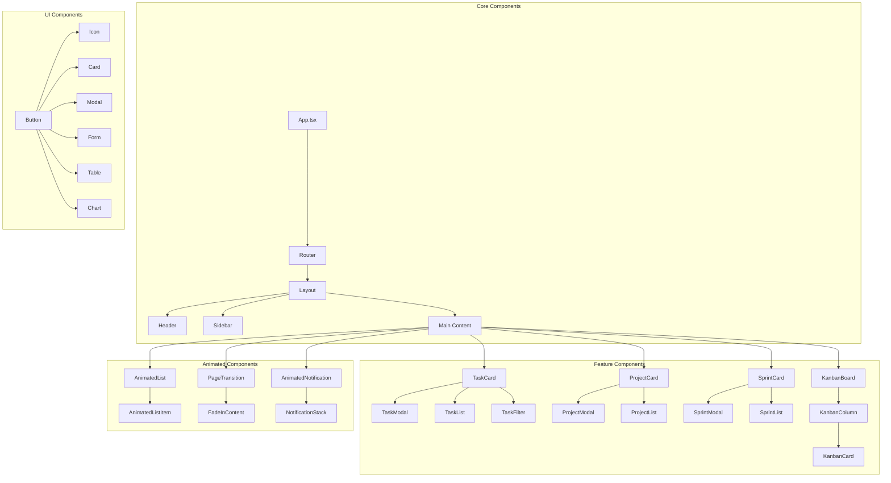
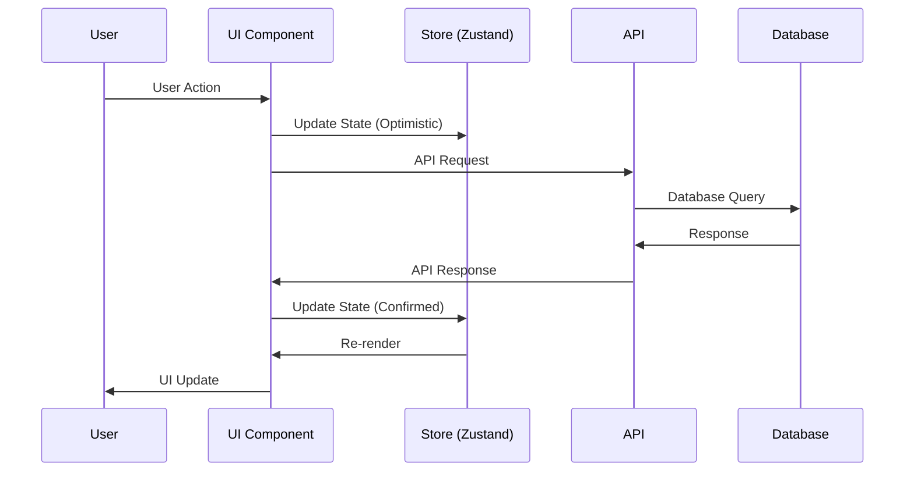
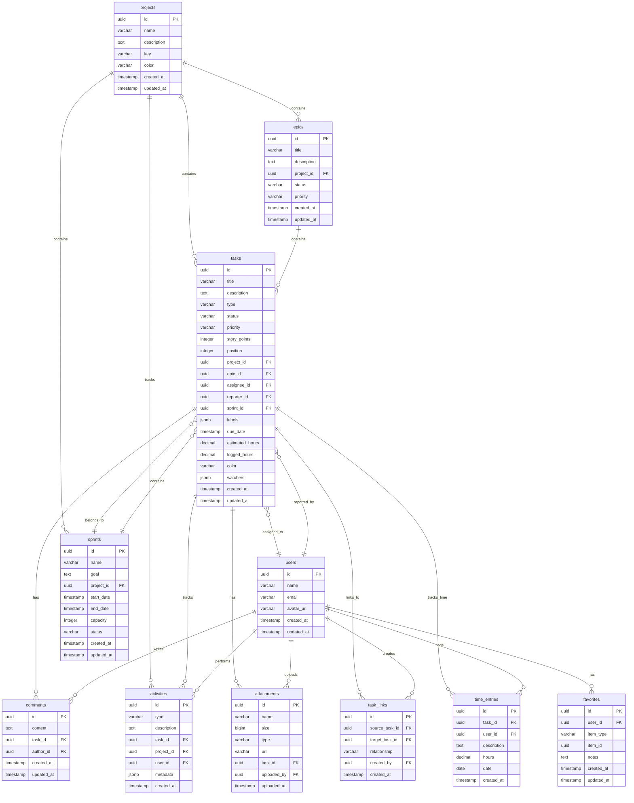
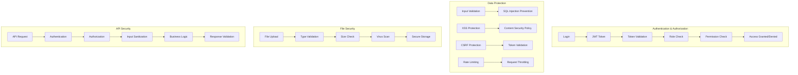
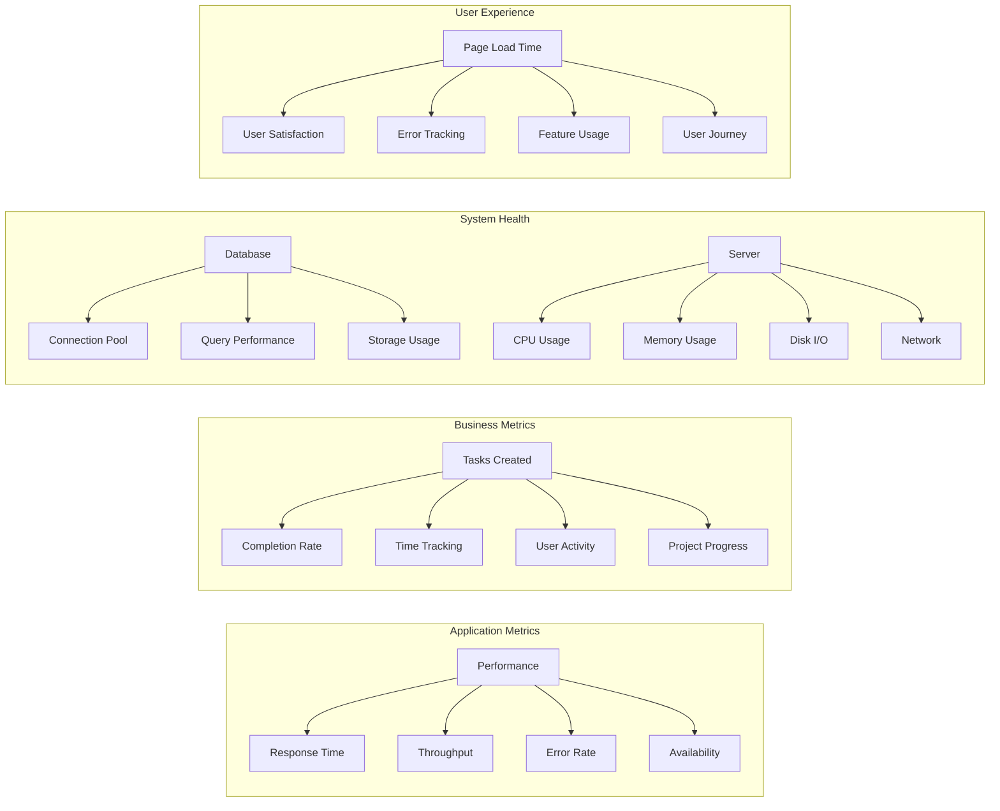
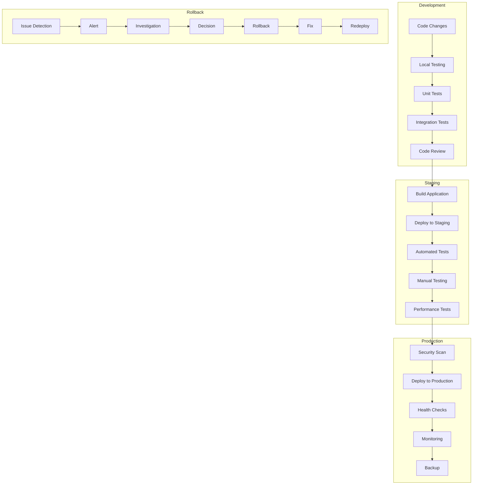
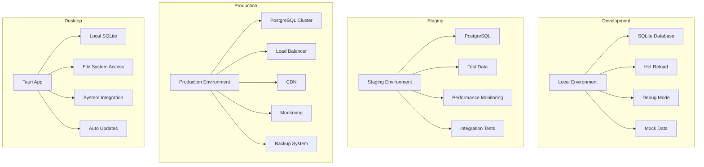
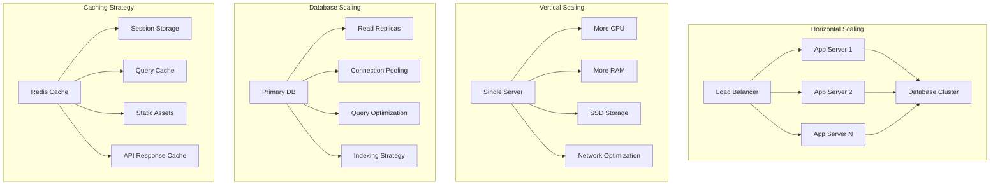

# TaskFlow Pro - Архитектура системы

## 🏗️ Общая архитектура

```mermaid
graph TB
    subgraph "Frontend (React + TypeScript)"
        A[React App] --> B[Zustand Store]
        A --> C[UI Components]
        A --> D[Pages]
        A --> E[Hooks]
        
        C --> F[Animated Components]
        C --> G[Form Components]
        C --> H[Data Components]
        
        D --> I[Dashboard]
        D --> J[Projects]
        D --> K[Tasks]
        D --> L[Sprints]
        D --> M[Kanban]
        D --> N[Calendar]
        D --> O[Analytics]
        D --> P[Settings]
    end
    
    subgraph "Backend (Node.js + Express)"
        Q[Express Server] --> R[API Routes]
        Q --> S[Middleware]
        Q --> T[Services]
        Q --> U[Database]
        
        R --> V[Projects API]
        R --> W[Tasks API]
        R --> X[Sprints API]
        R --> Y[Users API]
        R --> Z[Analytics API]
        
        S --> AA[Auth Middleware]
        S --> BB[Validation Middleware]
        S --> CC[Error Handler]
        S --> DD[Logger]
        
        T --> EE[Project Service]
        T --> FF[Task Service]
        T --> GG[Sprint Service]
        T --> HH[User Service]
        T --> II[Analytics Service]
    end
    
    subgraph "Database"
        U --> JJ[SQLite/PostgreSQL]
        JJ --> KK[Projects Table]
        JJ --> LL[Tasks Table]
        JJ --> MM[Sprints Table]
        JJ --> NN[Users Table]
        JJ --> OO[Comments Table]
        JJ --> PP[Activities Table]
    end
    
    subgraph "Desktop App (Tauri)"
        QQ[Tauri App] --> RR[Rust Backend]
        QQ --> A
        RR --> SS[File System]
        RR --> TT[SQLite Local]
        RR --> UU[System APIs]
    end
    
    A <--> Q
    QQ <--> Q
```

## 📱 Компонентная архитектура

## 🔄 Поток данных

## 🗄️ Структура базы данных

## 🔐 Система безопасности

## 📊 Система мониторинга

## 🚀 Процесс развертывания

## 🔧 Конфигурация окружений

## 📈 Масштабирование

