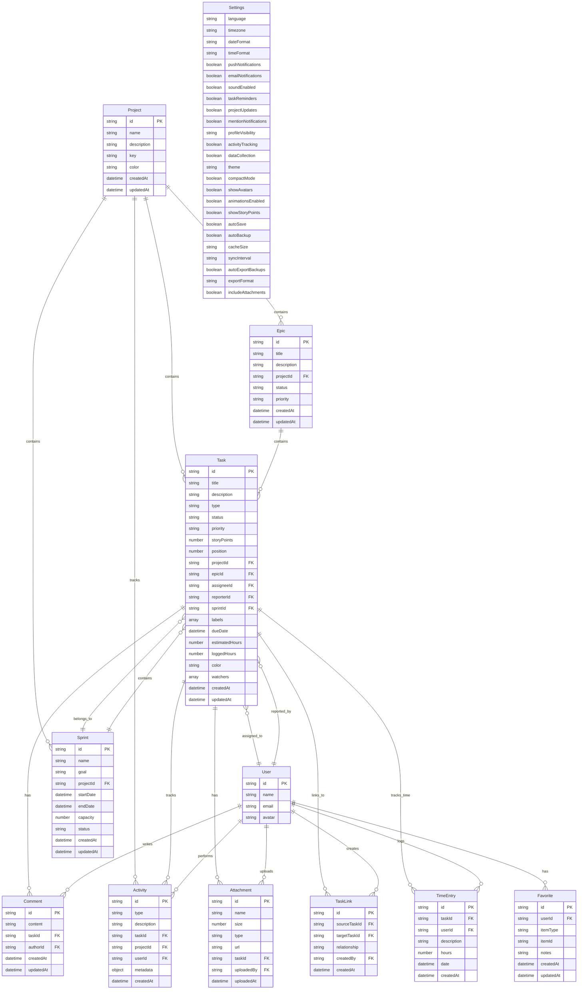
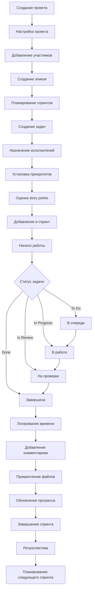
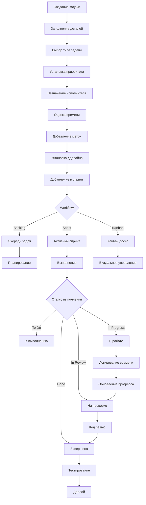
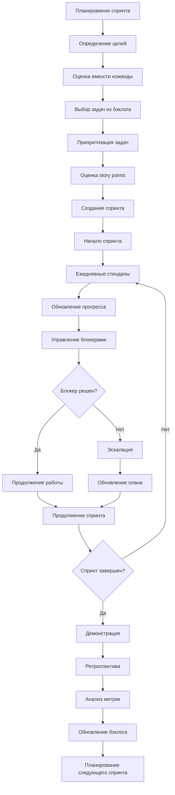
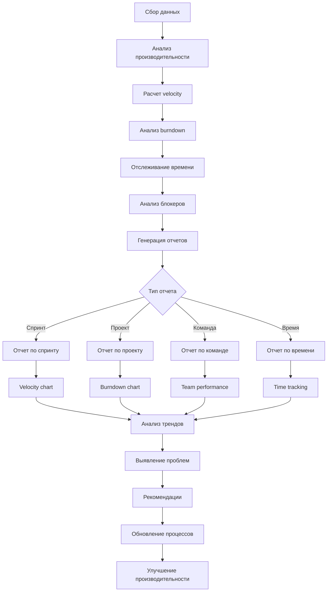

# TaskFlow Pro - Документация

## 📋 Схема Сущностей (Entity Relationship Diagram)

## 🔄 Схема Процессов (Process Flow Diagram)

### 1. Процесс управления проектами

### 2. Процесс управления задачами

### 3. Процесс управления спринтами

### 4. Процесс аналитики и отчетности

## 🏗️ Архитектура системы

### Frontend (React + TypeScript)
- **UI Framework**: React 18 с TypeScript
- **State Management**: Zustand с Immer
- **Styling**: Tailwind CSS
- **Animations**: Framer Motion
- **Icons**: Lucide React
- **Components**: Radix UI + Custom components
- **Routing**: React Router DOM
- **Forms**: React Hook Form + Zod validation

### Backend (Node.js + Express)
- **Runtime**: Node.js
- **Framework**: Express.js
- **Database**: SQLite (локально) / PostgreSQL (продакшн)
- **ORM**: Prisma
- **Authentication**: JWT
- **Validation**: Zod
- **Logging**: Winston
- **Testing**: Jest + Supertest

### Desktop App (Tauri)
- **Framework**: Tauri (Rust + WebView)
- **Frontend**: React (тот же код)
- **Database**: SQLite
- **File System**: Native file system access
- **Auto-updates**: Tauri updater

## 📊 Основные функции

### 1. Управление проектами
- ✅ Создание и настройка проектов
- ✅ Управление участниками
- ✅ Цветовая кодировка
- ✅ Настройка ключей проектов

### 2. Управление задачами
- ✅ Создание задач разных типов (Story, Bug, Epic, Task)
- ✅ Назначение исполнителей
- ✅ Установка приоритетов
- ✅ Оценка story points
- ✅ Добавление меток
- ✅ Установка дедлайнов
- ✅ Прикрепление файлов
- ✅ Связывание задач

### 3. Управление спринтами
- ✅ Планирование спринтов
- ✅ Установка целей
- ✅ Оценка емкости
- ✅ Отслеживание прогресса
- ✅ Burndown charts

### 4. Канбан доска
- ✅ Drag & Drop
- ✅ Фильтрация
- ✅ Поиск
- ✅ Быстрое редактирование
- ✅ Статистика

### 5. Календарь
- ✅ Просмотр задач по датам
- ✅ Управление дедлайнами
- ✅ Цветовая кодировка
- ✅ Фильтрация по проектам

### 6. Аналитика
- ✅ Velocity charts
- ✅ Burndown charts
- ✅ Time tracking
- ✅ Team performance
- ✅ Project metrics

### 7. Настройки
- ✅ Персонализация интерфейса
- ✅ Уведомления
- ✅ Экспорт данных
- ✅ Резервное копирование
- ✅ Интеграции

## 🔧 Технические особенности

### Анимации и UX
- **Framer Motion**: Плавные переходы и анимации
- **Spring animations**: Естественное движение
- **Stagger effects**: Поэтапное появление элементов
- **Hover states**: Интерактивные эффекты
- **Loading states**: Индикаторы загрузки

### Производительность
- **Virtual scrolling**: Для больших списков
- **Lazy loading**: Компонентов и данных
- **Memoization**: React.memo и useMemo
- **Code splitting**: Разделение кода
- **Optimistic updates**: Быстрый UI

### Безопасность
- **Input validation**: Zod схемы
- **XSS protection**: React автоматически
- **CSRF protection**: Токены
- **Rate limiting**: API ограничения
- **Data encryption**: Чувствительные данные

### Совместимость
- **Cross-platform**: Windows, macOS, Linux
- **Responsive design**: Адаптивный интерфейс
- **Accessibility**: WCAG 2.1 AA
- **Offline support**: Локальное хранение
- **Sync**: Автоматическая синхронизация

## 📈 Метрики и KPI

### Команда
- **Velocity**: Story points за спринт
- **Capacity**: Доступное время команды
- **Sprint completion rate**: Процент завершения спринтов
- **Bug rate**: Количество багов на спринт

### Проект
- **Project completion**: Процент завершения проекта
- **Time tracking accuracy**: Точность учета времени
- **On-time delivery**: Своевременная доставка
- **Customer satisfaction**: Удовлетворенность клиента

### Индивидуальные
- **Task completion rate**: Процент завершения задач
- **Time logged**: Учет времени
- **Code review participation**: Участие в код-ревью
- **Knowledge sharing**: Обмен знаниями

## 🚀 Roadmap

### Версия 1.1
- [ ] Интеграция с Git (GitHub, GitLab)
- [ ] CI/CD pipeline integration
- [ ] Advanced reporting
- [ ] Team collaboration features

### Версия 1.2
- [ ] Mobile app (React Native)
- [ ] Real-time collaboration
- [ ] Advanced analytics
- [ ] API integrations

### Версия 2.0
- [ ] AI-powered insights
- [ ] Predictive analytics
- [ ] Advanced automation
- [ ] Enterprise features
